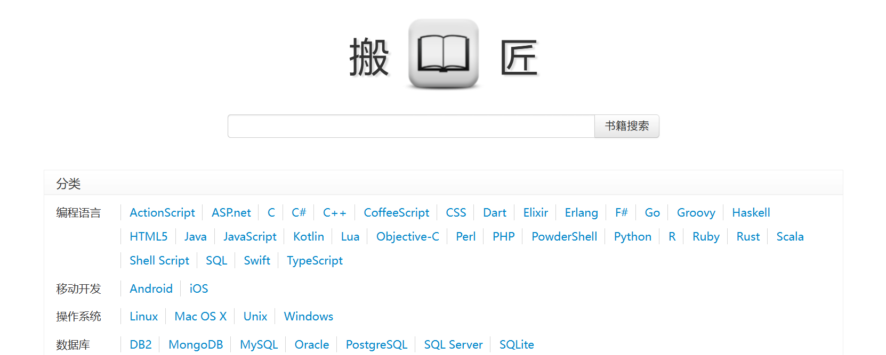
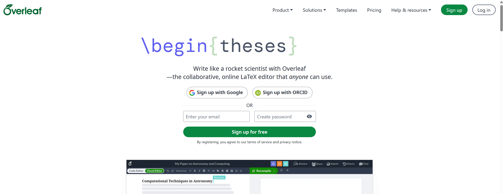
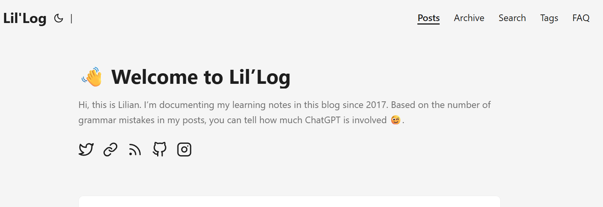
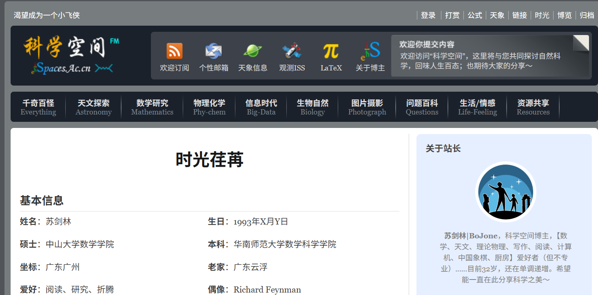

# 📚 大数据应用协会 资源导航站

本项目旨在为协会成员筛选最优质的学习路径，涵盖从入门到进阶的全方位资源。

------

## ⚡ 快速跳转 (Quick Links)

> [!TIP]
>
> **初学者请直奔 [🚀 新手村](https://www.google.com/search?q=%23-新手村-quick-start)** | **查资料请看 [📖 核心分类](https://www.google.com/search?q=%23-核心分类-core-categories)**

- [🚀 新手村 (Quick Start)](https://www.google.com/search?q=%23-新手村-quick-start)
- [📂 领域知识图谱 (Roadmap)](https://www.google.com/search?q=%23-领域知识图谱-roadmap)
- [📖 核心分类 (Core Categories)](https://www.google.com/search?q=%23-核心分类-core-categories)
  - [🎓 高质量网课](https://www.google.com/search?q=%23-高质量网课-courses)
  - [📕 必读书单](https://www.google.com/search?q=%23-必读书单-books)
  - [📄 经典论文](https://www.google.com/search?q=%23-经典论文-papers)
  - [🌐 优质博主/技术站](https://www.google.com/search?q=%23-优质博主技术站-blogs)
- [🛠️ 常用工具箱](https://www.google.com/search?q=%23-常用工具箱-toolbox)
- [💡 如何贡献资源](https://www.google.com/search?q=%23-如何贡献资源)

------

## 🚀 Quick Start

这里是专门为初学者准备的“直通车”，仅列出**每个方向最受公认**的 1-2 个神级资源。

| **方向**       | **推荐资源** | **评价**         | **链接** |
| -------------- | ------------ | ---------------- | -------- |
| **基础领域 A** | CS61A / SICP | 培养思维的起点   |          |
| **基础领域 B** | MIT 18.06    | 奠定数学底层逻辑 |          |

------

## 📂 Roadmap

> 点击下方链接查看详细的技能树和学习建议（建议配合 [Roadmap.sh](https://www.google.com/search?q=https://roadmap.sh) 使用）。

- **[CS自学路线](csdiy.wiki)** ：这是一本计算机的自学指南
- 算法学习：[零涂山艾府的题单](https://leetcode.cn/discuss/post/3141566/ru-he-ke-xue-shua-ti-by-endlesscheng-q3yd/)和[oi-wiki](https://oi-wiki.org/)

#### 基础技能

- [信息检索](bilibili.com/video/BV1yw411F7J1/?spm_id_from=333.337.search-card.all.click)：在当下一个信息量爆炸的时代，拥有基本的信息检索能力能够帮助我们更快更准确的找到需要信息

- [计算机开发基础](https://www.bilibili.com/video/BV1XN4y187zp/?spm_id_from=333.1387.favlist.content.click&vd_source=3bed69f70c36324c0d9416363628947e)：该课程是MIT开设的用来指导CS学生的计算机基础工具使用的课程，包括shell、vim、git等

------

## 📖 核心分类 (Core Categories)

### 🎓 高质量网课 (Courses)

*按“质量”而非“数量”排序，优先推荐带有课后作业和实验的公开课。*

- **[课程名称]** - [学校/机构] - [主讲人]
  - **特点**：几乎给出当前市面上所有常用的电子书的链接
  - **资源**：[课程主页] | [视频地址] | [中文翻译版]
- **[课程名称]** - [平台]
  - **特点**：短小精悍，适合快速上手。

### 📕 Books

#### 电子书网站

以下给出了三种电子书的获取方式，其中第一个链接虽然包含了后面两个链接。但是就实际情况而言，能够科学上网的同学常用的方式为Z-lib，不能则使用第三种方式搬书匠

- [Reddit上电子书网站综合链接](https://www.reddit.com/r/Piracy/wiki/megathread/books/)

  

  

  - **特点**：几乎给出了所有常用的电子书网站链接，包括z-lib、搬书匠等。该论坛不止包含电子书，还有一些其他“免费”的软件等。注意：Reddit需要科学上网

-  [Z-lib](https://z-lib.gl/)

  

  

  - **特点**：包含国内外大量的电子书、期刊论文等。注意：z-lib需要科学上网

  

- [搬书匠](http://www.banshujiang.cn/)

  

  

  - **特点**：包含大量的中文电子书，尽管电子书的数量远不如Z-lib，但是好在不需要使用科学上网的方式访问。

#### 一些高质量的电子书推荐

- [几何深度学习](https://github.com/GuangfuWang/geometric-deep-learning-chinese-translation-scripts)：本书是由来自帝国理工大学、DeepMind团队等知名研究人员于2021年写作成稿的一本介绍试图统一目前深度学习领域各种框架五花八门、百花齐放的现状的书籍，被称为AI4Science领域的圣经。该链接为翻译版的链接，非原文链接。
- [What Every Programmer Should Know About Memory](https://people.freebsd.org/~lstewart/articles/cpumemory.pdf)：这是一本专门分析Memory的书，对想要做数值计算和CUDA的同学来说是非常好的。
- [CUDA-programming-guide](https://docs.nvidia.com/cuda/cuda-programming-guide/01-introduction/introduction.html)：英伟达官方的CUDA编程教程
- [深度表达学习](https://ma-lab-berkeley.github.io/deep-representation-learning-book/zh/Ch1.html)：马毅写的关于深度学习中表示学习相关的书籍，包括压缩感知、控制理论等
- [Understanding Deep Learning](https://udlbook.github.io/udlbook/)：MIT的深度学习教材

#### 一些高质量的项目推荐

##### 深度学习领域

- [NanoGPT](https://github.com/karpathy/nanoGPT)：一个追求极致精简、易于理解和复现的 **GPT 架构实现**，专注于展示大语言模型的核心训练逻辑。
- [NanoChat](https://github.com/karpathy/nanochat)：基于轻量化架构打造的**极简对话交互界面**，旨在为用户提供快速、高效且无冗余的 AI 交流体验。

##### 并行计算领域

- [Nvidia官方的CUDA代码库](https://github.com/NVIDIA/accelerated-computing-hub)

### 📄 Paper

|                   **网站**                    |        **包含领域**        |                           **描述**                           |
| :-------------------------------------------: | :------------------------: | :----------------------------------------------------------: |
|          [Arxiv](https://arxiv.org/)          | 预印本、计算机科学、物理等 | 全球最大的开源预印本库，论文无需审核即可发布，是获取前沿技术（如 $AI$ 论文）的首选。 |
| [Google Scholar](https://scholar.google.com/) |        综合学术文献        | 覆盖全球最全的学术搜索工具，可查询引用量、下载地址及不同版本的学术文章。 |
| [Hugging Face](https://huggingface.co/papers) |    机器学习、预训练模型    | 被称为“AI 界的 GitHub”，提供开源模型权重、数据集、Demo 演示以及最新的 AI 论文讨论。 |
|      [papers.cool](https://papers.cool/)      |    Arxiv 论文导读/聚合     | 由 Karpathy 等大佬推崇的 Arxiv 极简阅读工具，支持按热度排序、快速预览摘要和相关性搜索。 |
|         [知网](https://www.cnki.net/)         |     综合学术、中文期刊     | 国内最权威的学术资源数据库，包含硕博士论文、期刊、会议论文及各类报纸报刊。 |

#### 🖊  论文写作工具

[Overleaf](https://www.overleaf.com/for/enterprises)：一款LaTeX编译论文的网站（现在几乎所有的学术论文都使用LaTeX进行编写）

[LaTeX论文模板](https://latextemplates.com/)：该网站给出了一些类型文章的模板，但是记住一般期刊或者会议都会提供其论文的模板，该链接提供的模板不适宜用于专业的写作

####  🎓  论文写作指导

[如何撰写高质量科技论文](https://www.bilibili.com/video/BV1QK4y1g71C/?spm_id_from=333.337.search-card.all.click&vd_source=3bed69f70c36324c0d9416363628947e)：由清华大学刘洋院长讲解NLP领域的论文高质量写作范式

#### 推荐的一些文章

- [变分自编码器](https://arxiv.org/abs/1711.00937)：当下VAE技术的常用方法
- [Transformer](https://arxiv.org/abs/1706.03762):   无需多言
- [VIT](https://arxiv.org/abs/2010.11929) :  首次将图像数据使用transformer进行处理
- [GNN](https://www.google.com/search?q=GNN&oq=GNN&gs_lcrp=EgZjaHJvbWUyDggAEEUYORhDGIAEGIoFMgcIARAAGIAEMgcIAhAAGIAEMgwIAxAAGEMYgAQYigUyBwgEEAAYgAQyCQgFEAAYChiABDIHCAYQABiABDIJCAcQLhgKGIAEMgcICBAAGIAEMg0ICRAuGMcBGNEDGIAE0gEIMzQ3M2owajmoAgCwAgA&sourceid=chrome&ie=UTF-8)：算是图神经网络入门的相关文章

- [多模态综述](https://www.techrxiv.org/users/993777/articles/1355509-a-survey-of-unified-multimodal-understanding-and-generation-advances-and-challenges)：比较新且高质量的一篇多模态领域综述

### 🌐 Blogs

*在这个碎片化时代，关注这几个人的博客就够了。*

- [Lilian Weng](https://lilianweng.github.io/)：博客主要针对 **人工智能前沿综述与大规模模型系统** 领域，涵盖生成式 AI、强化学习、大规模预训练模型的工程架构以及Agents等前沿热点，非常适合**需要快速构建领域全景认知的研究者**、**寻找论文综述灵感的学生**以及追求工业级架构实现参考的算法工程师阅读。

- [苏剑林（科学空间）](https://spaces.ac.cn/me.html)：博客主要针对 **深度学习理论推导、自然语言处理（NLP）及数学建模** 领域，深度探讨 Transformer 改进、概率图模型以及各种损失函数的本质，非常适合**对底层数学原理有极致追求的技术极客**、**致力于算法创新与优化的科研人员**以及喜欢推导发现神经网络之规律的深度学习爱好者。

------

## 🛠️ Toolbox

- **文献管理**：[Zotero](https://www.zotero.org) (配合插件极其强大)

- **PDF内嵌内容提取**：[MinerU](https://mineru.net/OpenSourceTools/Extractor?source=github)(适合在要使用原图做学术报告和学术论文笔记的时候使用)

- **环境配置**：

  - [Ubuntu](https://ubuntu.com/download/desktop)：一款相对简单使用的Linux系统，用于做深度学习开发

  - [Conda](https://www.anaconda.com/download/success)：强大的多平台**包管理与虚拟环境管理工具**，用于隔离不同项目的依赖库以避免版本冲突。

  - [Pytorch](https://pytorch.org/)：基于 Python 的主流开源**深度学习框架**，以动态计算图和灵活的科研/生产特性著称。

  - [CUDA](https://developer.nvidia.com/cuda-downloads)：由 NVIDIA 推出的**并行计算平台和编程模型**，利用 GPU 的强大算力大幅加速深度学习训练。

    环境配置的总体教程参考[从零开始安装Linux双系统配置环境进行深度学习](https://www.bilibili.com/video/BV1QxYReJEm3/?spm_id_from=333.1387.favlist.content.click&vd_source=3bed69f70c36324c0d9416363628947e)

- **PPT制作**：

  - [slidesgo](https://slidesgo.com/)：一个提供许多优质免费PPT模板的网站
  - [Notebooklm](https://notebooklm.google.com/notebook/99a28b6f-7c53-4190-abb6-b177d653ad6e)：AI生成PPT

- **文件链接查毒**：[virustotal](https://www.virustotal.com/)（Google给出的免费的文件链接查毒网站，无需科学上网）

- **反推荐系统信息获取**：[Folo](https://app.folo.is/)可以直接订阅含有RSS协议的网站链接，可以避免自己被平台的推荐系统推荐不相关的信息，提高信息获取效率

- **算法刷题网站**：

  - [Leetcode](https://leetcode.cn/)：球最流行的程序员面试准备平台，涵盖海量经典面试题，支持多种编程语言
  - [洛谷](https://www.luogu.com.cn/)：国内功能强大的算法竞赛 (OI/ACM) 社区，题库分级科学，拥有活跃的讨论氛围和丰富的原创比赛
  - [牛客](https://www.nowcoder.com/)：集笔面试题库、求职讨论和名企招聘于一体的综合平台，尤其以还原国内各大互联网公司的历年校招真题著称

- **机器学习算法比赛网站**：

  - [kaggle](https://www.kaggle.com/)：全球最大的数据科学和机器学习竞赛社区，提供真实行业数据集及免费的 GPU 算力资源，是提升实战经验和建立行业背景的标杆。
  - [天池](https://tianchi.aliyun.com/competition/)：阿里巴巴旗下的开发者社区，专注于解决真实的业务挑战（如智慧城市、电商预测），为开发者提供丰富的奖金和优质的数据赛道。

------

## 💡 如何贡献资源

协会的力量在于每一位成员的分享！如果你发现了高质量资源：

1. **Fork** 本仓库。
2. 在对应的文件夹或分类下添加资源信息（请遵循现有的排版格式）。
3. 提交 **Pull Request**，并在描述中简要说明推荐理由。
4. 如果你不熟悉 Git，也可以在 **[Issues]** 中直接留言。

------

## ✨ 鸣谢

我们谨向所有为本项目做出贡献的个人表示衷心的感谢！

 <!-- 自动生成的贡献者头像墙，替换下面的 repo 地址即可 -->

    *特别感谢所有提供建议、修正错别字和维护链接的朋友们。*

------

### 🎨 给维护者的建议（如何保持“精美”）：

为保持本仓库的高质量和用户友好性，请在贡献或维护时遵循以下指南： 

1. **🎯 精选质量    **

   * **质量优于数量**：不要简单地堆砌链接。只收录"同类最佳"的资源。    
   * **折叠长列表**：如果某个分类超过 10 项，请使用 `
` 标签折叠内容，保持主视图整洁。 

   

2. **🏷️ 清晰标注    **
   * **语言标签**：始终在资源标题后附加 `[CN]`（中文）或 `[EN]`（英文）。这有助于用户快速评估学习难度。    
   * **难度等级**：在适用的情况下，考虑添加难度标签（如 `入门 `、` 进阶`）。 

3. **🎨 视觉一致性**    
   - **统一 Emoji**：对分类使用一致的 Emoji（例如：🎓 表示课程，📚 表示书籍，💻 表示工具）。    
   - **表格对齐**：确保所有表格正确对齐，便于阅读。 

4. **🧹 定期清理**    
   * **修复死链**：定期检查并移除失效链接（404）。    
   * **更新内容**：归档或删除过时的博客文章和教程，保持本列表的"高质量"标准。 

> 💡 **需要帮助？** 
>
> 如果您需要特定领域的示例，如*数学建模*、*高性能计算*或*量化金融*，欢迎提交 Issue！